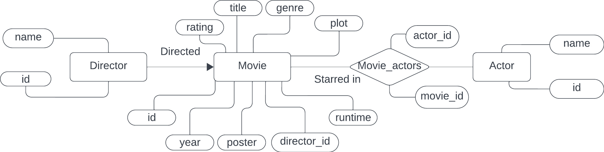

# MyKino
Mykino is a website running python and flask library. The application can be used for searching and filtering for movies.

## Requirements:
Run the code below to install the necessary modules.
    
    $ pip install -r requirements.txt


## Database init
1. set the database username and password in load.py and app.py
2. run schema.sql in your database
3. run load.py using command:
```
    $ python3 load.py
```
Example on how to run sql files: 
```
    psql -d{database} -U{user} -W -f schema.sql
```
#### notes
For Ubuntu add host (-h127.0.0.1) to psql: 
```
    psql -d{database} -U{user} -h127.0.0.1 -W -f schema.sql
```
schema_drop.sql can be used to drop the schema.


## Running flask
### The python way
    python3 run.py

### The flask way.
    export FLASK_APP=run.py
    export FLASK_DEBUG=1           (Replaces export FLASK_ENV=development)
    export FLASK_RUN_PORT=5004     (Optional if you want to change port numbe4. Default port is port 5000.)
    flask run
